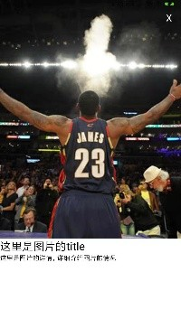

# React Native 实现 App Store Today页效果

### React Native 动效系列

欢迎大家Star我们的仓库[react-native-showcase](https://github.com/rrd-fe/react-native-showcase)，记录了各种React Native的交互、动画效果。

* [卡片动感光效](https://github.com/rrd-fe/blog/blob/master/react-native/motion-event.md)
* [九宫格抽奖](https://github.com/rrd-fe/blog/blob/master/react-native/lottery.md)
* [自定义下拉刷新动画](https://github.com/rrd-fe/blog/blob/master/react-native/react-native-pulltorefresh.md)

本文介绍如何实现利用共享UI元素的动画，实现类似苹果App Store的Today页面的动画效果，我们先看最终的效果：


### 第一步：完成静态UI布局

UI布局很简单，就是一个普通的ScrollView，我们直接看代码：

```javascript
<ScrollView style={{ flex: 1,  paddingTop: 20, }}>
    {
        Images.map((image, index) => {
            return (
                <View style={{ width: SCREEN_WIDTH, height: SCREEN_HEIGHT - 150, padding: 15 }}>
                    <Image
                        source={image}
                        style={{
                            height: null,
                            width: null,
                            borderRadius: 20,
                            flex: 1,
                            resizeMode: 'cover',
                        }}
                    />
                </View>
            );
        })
    }
</ScrollView>
```

也可以直接打开[expo project](https://snack.expo.io/@wangcheng714/apple-app-of-the-day---1)查看第一步效果。

### 第二步：完成打开详情页动画

在开始写代码之前我们先分先一下动画的几个特点：

* 首先我们要明确从列表"页"到详情"页"，其实并不是真正意义的页面跳转（至少现有的无论是react-navigation还是react-native-navigation等都无法实现这种复用页面UI元素的跳转动画），因此所谓的列表"页"、详情"页"只是同一个页面的两种不同状态的View

* 有了上面的结论，我们在自己分析动画效果：其实整个打开详情动画有两部分组成：

        1. 详情"页"图片从当前点击位置和大小移动到最终顶部位置
        2. 在此过程中图片介绍文案位置从屏幕视觉外移动到最终位置

下面我们来看看具体代码如何实现：

首先完成详情"页"布局:

```javascript
<ScrollView style={{ flex: 1,  paddingTop: 20, }}>
    ...
</ScrollView>
<View style={StyleSheet.absoluteFill}>
    <View style={{ flex: 2 }}>
    <Image
        source={ this.state.activeImage ? this.state.activeImage : null }
        style={{ top: 0, right: 0, height: null, width: null, resizeMode: 'cover' }}
    />
    <TouchableWithoutFeedback>
        <View style={{ position: 'absolute', right: 20, top: 30 }}>
        <Text style={{ fontSize: 20, color: '#fff' }}>X</Text>
        </View>
    </TouchableWithoutFeedback>
    </View>
    <View style={{ flex: 1, backgroundColor: '#fff', }}>
        <Text style={{ fontSize: 24 }}>这里是图片的title</Text>
        <Text>这里是图片的详情，详细介绍图片的情况</Text>
    </View>
</View>
```
我们先隐藏列表页，详情页如下图所示：



接下来我们需要给：图片、文字介绍内容区域、关闭按钮等分别添加动画效果。

图片动画效果分析：当用户点击列表图片时，从用户当前点击图片的位置、大小变化到最终详情"页"中图片位置和大小。

我们可以利用当前点击图片Ref的measure方法中拿到它的位置和大小信息，代码如下：

```javascript

constructor(props) {
    // 存贮所有的图片ref，动画时获取当前图片的位置信息
    this.imageRef = [];
    this.state = {
      activeImage: null,
    }
}

function openImage(index) {
    this.imageRef[index].measure((x, y, width, height, pageX, pageY) => {
        // pageX、pageY 图片在屏幕中的坐标位置
        // width、height 图片的宽高
        // ...... 有了图片的位置和大小信息我们就可以开始动画了
    });
}

<TouchableWithoutFeedback onPress={() => { this.openImage(index); }}>
    <Image
        source={image}
        ref={(image) => { this.imageRef[index] = image; }}
        style={{ height: null, width: null, borderRadius: 20, flex: 1, resizeMode: 'cover', }}
    />
</TouchableWithoutFeedback>

```

下面我们来完成图片的动画效果：位置、大小、圆角等变化：

```javascript

constructor(props) {
    this.position = new Animated.ValueXY();
    this.measure = new Animated.ValueXY();
    this.animation = new Animated.Value(0);
}

function openImage(index) {
    // 获取点击图片的信息
    this.imageRef[index].measure((x, y, width, height, pageX, pageY) => {
        this.position.setValue({ x: pageX, y: pageY });
        this.measure.setValue({ x: width, y: height });
        this.setState(
            () => { return { activeImage: Images[index] } },
            () => {
                // 获取目标位置信息
                this.imageContainer.measure((x, y, width, height, pageX, pageY) => {
                    Animated.parallel([
                        Animated.timing(this.position.x, {
                            toValue: pageX,
                            duration: 350,
                            // 增加一个弹性效果
                            easing: Easing.back(1),
                        }),
                        Animated.timing(this.position.y, {
                            toValue: pageY,
                            duration: 350,
                            easing: Easing.back(1),
                        }),
                        Animated.timing(this.measure.x, {
                            toValue: width,
                            duration: 350,
                            easing: Easing.back(1),
                        }),
                        Animated.timing(this.measure.y, {
                            toValue: height,
                            duration: 350,
                            easing: Easing.back(1),
                        }),
                        Animated.timing(this.animation, {
                            toValue: 1,
                            duration: 350,
                            easing: Easing.back(1),
                        }),
                    ]).start();
                });
            }
        );
    });
}

const imageBorderRadiusAnimation = this.animation.interpolate({
    inputRange: [0, 1],
    outputRange: [20, 0]
});

const imageAnimationStyle = {
    left: this.position.x,
    top: this.position.y,
    width: this.measure.x,
    height: this.measure.y,
    borderRadius: imageBorderRadiusAnimation,
};

<TouchableWithoutFeedback onPress={() => { this.openImage(index); }}>
    <Image
        source={image}
        ref={(image) => { this.imageRef[index] = image; }}
        style={[
            { height: null, width: null, borderRadius: 20, flex: 1, resizeMode: 'cover', },
            imageAnimationStyle
        }
    />
</TouchableWithoutFeedback>
```

这样我们就完成了图片的动画效果，同样添加文字区域和关闭按钮的动画效果，完整代码可以[参考这里](https://snack.expo.io/@wangcheng714/apple-app-of-the-day---2)。

### 第三步：完成关闭详情页动画

其实关闭详情动画完全就是打开详情动画的反转：

1. 图片顶部位置还原到点击前位置，因此我们需要在打开详情时，保存点击图片在列表中的位置、大小信息
2. 详情文字介绍区域从底层消失
3. 关闭按钮逐渐变为透明消失

代码和打开详情比较类似，可以直接参考[最终版](https://snack.expo.io/@wangcheng714/apple-app-of-the-day)

### 广告

欢迎大家star我们的[人人贷大前端团队博客](https://github.com/rrd-fe/blog)，所有的文章还会同步更新到[知乎专栏](https://www.zhihu.com/people/ren-ren-dai-da-qian-duan-ji-zhu-zhong-xin/activities) 和 [掘金账号](https://juejin.im/user/5cb690b851882532941dd5d9)，我们每周都会分享几篇高质量的大前端技术文章。

