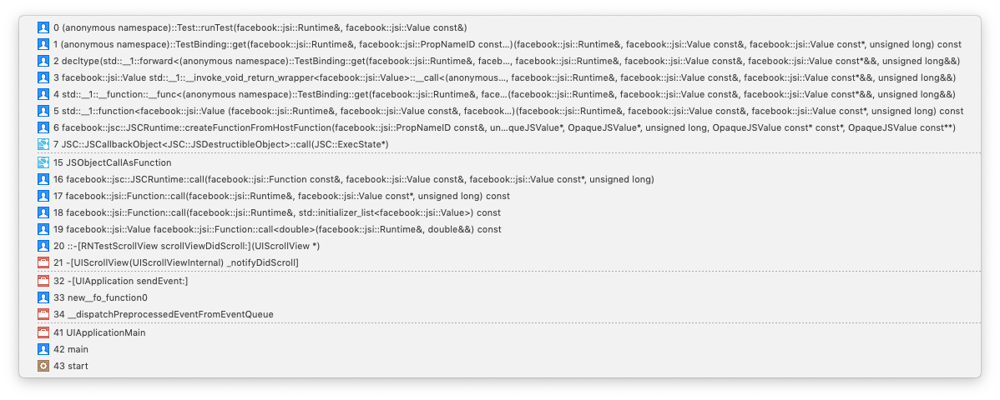

# JSI小试牛刀——Native同步调用JS代码

[上一篇](https://juejin.im/post/5d7757625188253264365456)有说到在有了JSI之后，JS和Native同时持有一个HostObject，那么JS和Native之间就有了同步调用的基础条件。

## JS同步调用Native

实际上，在现在的RN（以0.59版本为例）中，已经实现了JS向Native代码的同步调用，在iOS中，可以通过宏`RCT_EXPORT_BLOCKING_SYNCHRONOUS_METHOD`来实现。
```
@implementation ConfigManager

RCT_EXPORT_MODULE();

RCT_EXPORT_BLOCKING_SYNCHRONOUS_METHOD(getApiUrl)
{
	return API_URL;
}

@end
```
JS中的调用为
```
import { NativeModules } from 'react-native';

const apiUrl = NativeModules.ConfigManager.getApiUrl();
```
下面我们看一看RN是怎么实现的，首先通过查看Native端的宏定义和源码，可以追溯到
```
runtime_->global().setProperty(
  *runtime_,
  "nativeCallSyncHook",
  Function::createFromHostFunction(
      *runtime_,
      PropNameID::forAscii(*runtime_, "nativeCallSyncHook"),
      1,
      [this](
          jsi::Runtime&,
          const jsi::Value&,
          const jsi::Value* args,
          size_t count) { return nativeCallSyncHook(args, count); }));
```
然后查看JS中相应的调用为
```
function  genMethod(moduleID:  number, methodID:  number, type:  MethodType) {
  if (type  ===  'promise') {
    ...
  } else  if (type  ===  'sync') {
    fn = function(...args:  Array<any>) {
      ...
      return global.nativeCallSyncHook(moduleID, methodID, args);
    };
  }
  ...
}
```
其实就是通过JSI，创建了`nativeCallSyncHook`这个HostObject，实现了JS向Native的同步调用。

## Native同步调用JS

有了JSI，我们就可以完成Native向JS的同步调用，现在让我们尝试着实现[上一篇](https://juejin.im/post/5d7757625188253264365456)中说到的ScrollView的onScroll的同步任务。

既然JS向Native的同步调用是通过`nativeCallSyncHook`实现的，我们就来实现一个`jsCallSyncHook`吧，从Native线程（包括主线程）能同步调用JS的runtime中的方法。

### 功能代码

我们想要实现的是，滑动ScrollView，将其offset传到JS端进行业务逻辑处理，然后同步更新当前页面的一个Label的text。更新Native页面的代码为：
```
int Test::runTest(Runtime& runtime, const Value& vl) {
	// testView是包含UILabel和UIScrollView的UIView，lb即当前的UILabel
    lb.text = [NSString stringWithUTF8String:vl.toString(runtime).utf8(runtime).c_str()];
    [testView setNeedsLayout];
    return 0;
}
```

### 导出HostObject到JS

需要实现两个方法，第一个`install()`是导出全局属性`nativeTest`到JS的Runtime。

```
void TestBinding::install(Runtime &runtime, std::shared_ptr<TestBinding> testBinding) {
    auto testModuleName = "nativeTest";
    auto object = Object::createFromHostObject(runtime, testBinding);
    runtime.global().setProperty(runtime, testModuleName,
                                 std::move(object));
}
```

第二个是转出全局属性的方法`runTest`。

```
Value TestBinding::get(Runtime &runtime, const PropNameID &name) {
    auto methodName = name.utf8(runtime);
    
    if (methodName == "runTest") {
        return Function::createFromHostFunction(runtime, name, 0, [&test](Runtime& runtime,
                                                                          const Value &thisValue,
                                                                          const Value *arguments,
                                                                          size_t count) -> Value {
            return test.runTest(runtime, *arguments);
        });
    }
    
    return Value::undefined();
}
```

然后需要在合适的地方（比如视图组件init的时候）进行binding，也就是调用下`install()`。

```
auto test = std::make_unique<Test>();
std::shared_ptr<TestBinding> testBinding_ = std::make_shared<TestBinding>(std::move(test));
TestBinding::install(runtime, testBinding_);
```

我们在onScroll的时候调用JS的Runtime重的`jsCallSyncHook`全局对象，将ScrollView的offset值传过去。
```
- (void)scrollViewDidScroll:(UIScrollView *)scrollView {
    Runtime* runtime = (Runtime *)self.bridge.runtime;
    runtime->global().getPropertyAsFunction(*runtime, "jsCallSyncHook").call(*runtime, scrollView.contentOffset.y);
}
```

在JS代码里定义`jsCallSyncHook`这个全局对象，接收Native传过来的offset值，进行业务逻辑处理（这里仅是加了几个字，但是可以更复杂），然后调用之前已经绑定的`nativeTest`这个HostObject的`runTest`方法，继续完成同步调用。
```
global.jsCallSyncHook = function changeTxt(s) {
	global.nativeTest.runTest('现在的offset是'+s);
};
```
> 这里可能会遇到Native代码编译不过的问题，请在Build Setting中设置Clang的C++编译版本为C++11以上

### 最终效果
我们在Native的`runTest`处打上断点看一下调用堆栈



可以看到在主线程经过了Native->JS->Native的同步调用过程，大功告成。下面是模拟器里的效果


## Note

本篇只是JSI的简单尝试，代码均为测试代码，如果想充分利用JSI的强大功能，请静候RN后续的TurboModules和Fabric。

## Reference

[https://medium.com/@christian.falch/https-medium-com-christian-falch-react-native-jsi-challenge-1201a69c8fbf](https://medium.com/@christian.falch/https-medium-com-christian-falch-react-native-jsi-challenge-1201a69c8fbf)

[https://github.com/ericlewis/react-native-hostobject-demo](https://github.com/ericlewis/react-native-hostobject-demo)

[https://til.hashrocket.com/posts/hxfbncpqdn-export-a-synchronous-method-in-react-native-module](https://til.hashrocket.com/posts/hxfbncpqdn-export-a-synchronous-method-in-react-native-module)
